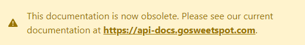

# GSS Freight API

Freight API provides programmatic access to GSS functionality and content.

The API is [REST API](http:/en.wikipedia.org/wiki/Representational_State_Transfer "RESTful") and uses single token key authentication.
Currently, return format for all endpoints is [JSON](http:/json.org/ "JSON").
Please also refer to [Postman samples](https://documenter.getpostman.com/view/17190235/UV5XixUJ).

***

## Checklist
* You need a GSS access token
* Familiarize yourself with API functionality
* Hack away

***

## Things you should know

* Ensure you calls to the api are capable of handling errors and downtime
* Fields may be added to the endpoints are any time, ensure you conversions are capable of handling this
* Fields names are not case sensitive
* If your system has more then one company utilising it, it is strongly recommended that you do not hardcode the access key and the api url
* This api was fully refresh on 18 Apr 2016. If you implementation was done prior to that, we suggest you update your implementation. The old version docs can be found [here](https://github.com/gosweetspot/freight-api/tree/version1-final).

## SDK

- **[C# Sample](https://github.com/gosweetspot/freight-api-csharp-sample)**

## SOME COMMON USE CASES
### You have a custom bespoke e-commerce or orders platform
Your site does not allow external systems to feed information into it directly.
Your approach will be to publish orders to GSS once the orders are ready for dispatch/labelling. On the GSS system your user would process the order.
At some stage your system will request the order status update from GSS.
The api interactions would be:
 
1. **[<code>PUT</code> api/customerorders](customerorders/put.md)** - triggered from your site when order is ready for ticketting

2. Using the GSS web portal, your dispatcher tickets the goods.

3. **[<code>GET</code> api/customerorders](customerorders/get.md)** - triggered by your system every 6 hours, to get status update on the order published earlier.

### You have a very specialised dispatch workflow
You might have a special requirement to integrate the ticketing directly into your existing system.  Using a external system to do one part of the workflow may affect performance and may not be acceptable.  You can use the GSS api to build the ticketing into your system.
The api interactions would be:
 
1. **[<code>POST</code> api/rates](rates/post.md)** - your system at dispatch, calls the api to get all available freight options and rates

2. **[<code>POST</code> api/shipments](shipments/post.md)** - the dispatcher reviews the freight options from (1) and makes a selection. A second call to generate the shipment is triggered.

### You use an open source platform
A lot of open source systems, also have a open API platform that GSS is able to tap into to build the integration directly from within GSS. We would consider any platform that our customers are using.  However depending on platform popularity the implementation time frames would be considered.  In the case that there are very few users on the platform, it may not be a sufficient business case for us to undertake the integration.

### Others
Surely there will be other cases that the api can be applied to.  Talk to us, and we will be able to help.

## Endpoints

#### Customer Orders
Using this endpoint, you can publish from your ERP or orders system, into the GSS orders queue. Once published, your operators on GSS will be able to search/scan/click on the order number, to automatically populate the order delivery details. This saves time entering the delivery details.

- **[<code>GET</code> api/customerorders](/customerorders/get.md)**
Retreives the list of orders already published to GSS. This can be filtered on multiple criteria.
- **[<code>PUT</code> api/customerorders](customerorders/put.md)**
Publish into the GSS queue your orders.

### Price Enquiry / Rates Query

- **[<code>POST</code> api/rates](rates/post.md)** Returns your available rates for the origin to destination specified.

### Creating Shipments

- **[<code>GET</code> api/shipments](shipments/get.md)** Retreives all your historically created shipments, including current status details.
- **[<code>POST</code> api/shipments](shipments/post.md)** Create a new shipment using a rate or with auto rating. Printing can be automatically triggered as well.
- **[<code>DELETE</code> api/shipments](shipments/delete.md)** Deletes the specified shipment.

### Manifesting
- **[<code>POST</code> v2/publishmanifest](v2/POST_publishmanifest.md)** Batch and manifest your current shipments ready for collection. Available on certain carriers only.

### Printing
- **[<code>GET</code> /api/printers](printers/get.md)** returns a list of available printers

- **[<code>GET</code> /api/labels](labels/get.md)** download the labels as png or pdf

- **[<code>POST</code> /api/labels](labels/post.md)** enqueues the supplied shipment for printing

- **[<code>POST</code> /api/labels/enqueue](labels/enqueue.md)** enqueues a raw image into the print queue for printing

### Pickup Booking
- **[<code>POST</code> /api/pickupbooking](pickupbooking/post.md)** book a driver to collect your parcels.

### Webhooks
GSS is able to provide feedback to your site using webhooks for certain action triggers.
Actions that can be subscibed to include:
- Shipment created
- Shipment pickup registered by courier
- Shipment delivery registered by courier

    [Configuration & Post data](webhooks/config.md)

### Tracing Your Calls
We allow you to view your most recent api calls to us. To view use https://ship.gosweetspot.com/developer/apitrace
This is provided to help you develop/debug your code.

## FAQ

### How do I connect to the API?
The API is only available to authenticated clients. Clients should authenticate users using an access_key obtained from the Preferences & Settings screen. Once authenticated, you need to request a resource from one of the endpoints using HTTP. Generally, reading any data is done through a request with GET method. 

If the user with the access_key has access to multiple sites in the account, a `site_id` HTTP header with the site id is also required, e.g. `site_id: 123456`.

### What return formats do you support?
Freight API currently returns data in [JSON](http:/json.org/ "JSON") format.  Some methods may return [XML] data, however we don't actively test for XML compatibility.

### What kind of authentication is required?
Applications must identify themselves to access any resource.
You need to contact your account manager to obtain a test access key.
Every request requires a http header property `access_key`, as well as `support_email`. The Support Email should contain the IT Level contact for the organisation. This will be used to contacting you, should we find your requests need attention.

If the user with the access_key has access to multiple sites in the account, a `site_id` HTTP header with the site id is also required.

### Is there a request rate limit?
Presently there is no rate limiting on the api. We however reserve the right to enforce limits or block calls at our discretion.  We request that you limit your requests to 60 calls per minute. If you expect to call at a higher rates, please contact us.

### Backwards Compatibility
We try to make every effort to ensure all our functions are backwards compatible.  However as our system evolves, we cannot guarrantee that we will be able to support all old/deprecated functions forever.  If you implementation breaks due to a change on our system, it will be your responsibility to update the functionality on your system.

### Should I crack on?
Sure, fire away, however, we do suggest you talk to us, prior to starting so we can understand your requirements and explain how best to use this api.
