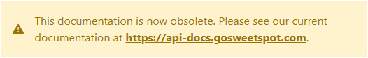

[](https://api-docs.gosweetspot.com/)

# Printers

    GET api/printers

## Description
Get the list of printers available to your user.

***

## Requires authentication
* A valid access key must be provided in `access_key` request header.
* If the user with the access_key has access to multiple sites in the account, a `site_id` HTTP header with the site id is also required.

***

## Return format
### Root Object
- An array of objects, where each object represents a printer available to your user.

### Printer
- **Printer** - string, Name of the print agent. This name can be passed to the PrintToPrinter field when creating shipments to indicate this printer should be printed to.
- **IsLabelPrinter** - bool
- **IsOnline** - bool
- **LabelType** - integer, represents a label type given in below table.
- **Name** - string
- **PrinterPath** - string
- **FullName** - string

**LabelType**

| Name | Value |
| ------ | ------ |
| EPL_LP2844 | 1 |
| EPL_INTERMEC | 2 |
| ZPL_GK420D | 3 |
| PNG | 4 |
| PDF | 5 |

## Example
**Request**

    https://api.gosweetspot.com/api/printers

**Headers**

    access_key: [access_key_for_site_account]
    
    Content-Type: application/json; charset=utf-8

**Return** __shortened for example purpose__
``` json

[
  {
		"Printer": "Warehouse >> NPIA1A447 (HP COLOR LASERJET MFP M277DW) (11111)",
		"IsLabelPrinter": true,
		"IsOnline": true,
		"LabelType": 4,
		"Name": "NPIA1A447 (HP Color LaserJet MFP M277dw)",
		"PrinterPath": "NPIA1A447 (HP Color LaserJet MFP M277dw)",
		"FullName": "SWEET SPOT GROUP LTD >> Warehouse >> NPIA1A447 (HP COLOR LASERJET MFP M277DW) (11111)"
	}, {
		"Printer": "Warehouse >> ZDESIGNER LP 2844 (COPY 1) (11112)",
		"IsLabelPrinter": true,
		"IsOnline": false,
		"LabelType": 4,
		"Name": "ZDesigner LP 2844 (Copy 1)",
		"PrinterPath": "ZDesigner LP 2844 (Copy 1)",
		"FullName": "SWEET SPOT GROUP LTD >> Warehouse >> ZDESIGNER LP 2844 (COPY 1) (11112)"
	}, {
		"Printer": "Warehouse >> ZDESIGNER LP 2844 (COPY 1) (11113)",
		"IsLabelPrinter": true,
		"IsOnline": false,
		"LabelType": 4,
		"Name": "ZDesigner LP 2844 (Copy 1)",
		"PrinterPath": "ZDesigner LP 2844 (Copy 1)",
		"FullName": "SWEET SPOT GROUP LTD >> Warehouse >> ZDESIGNER LP 2844 (COPY 1) (11113)"
	}
]


```
